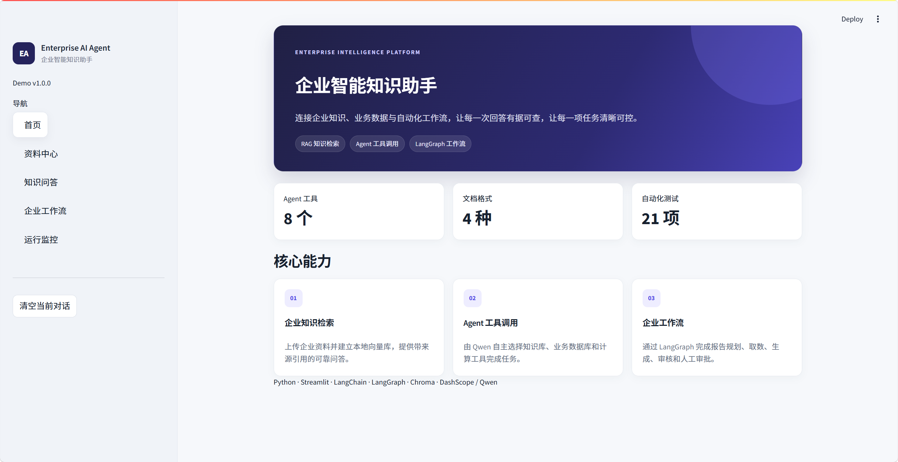
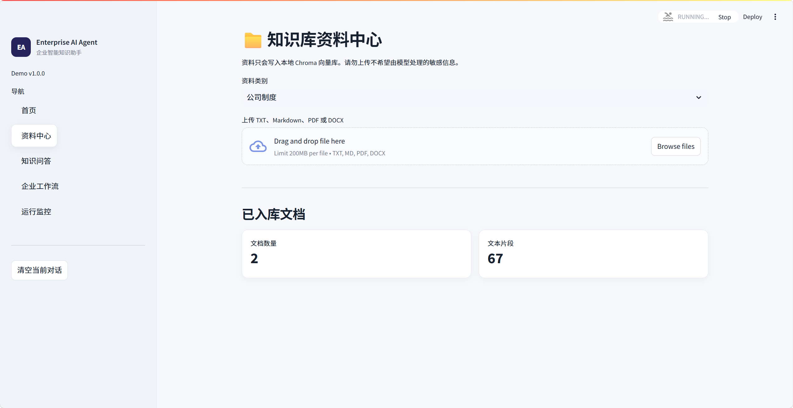
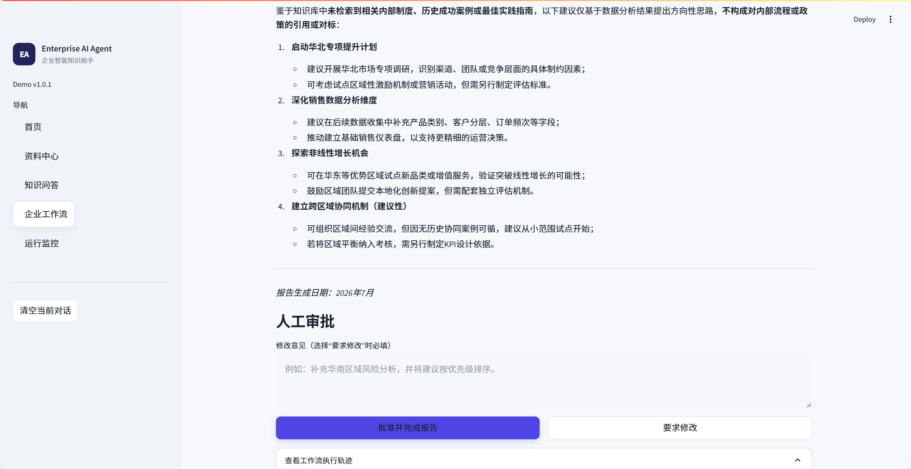
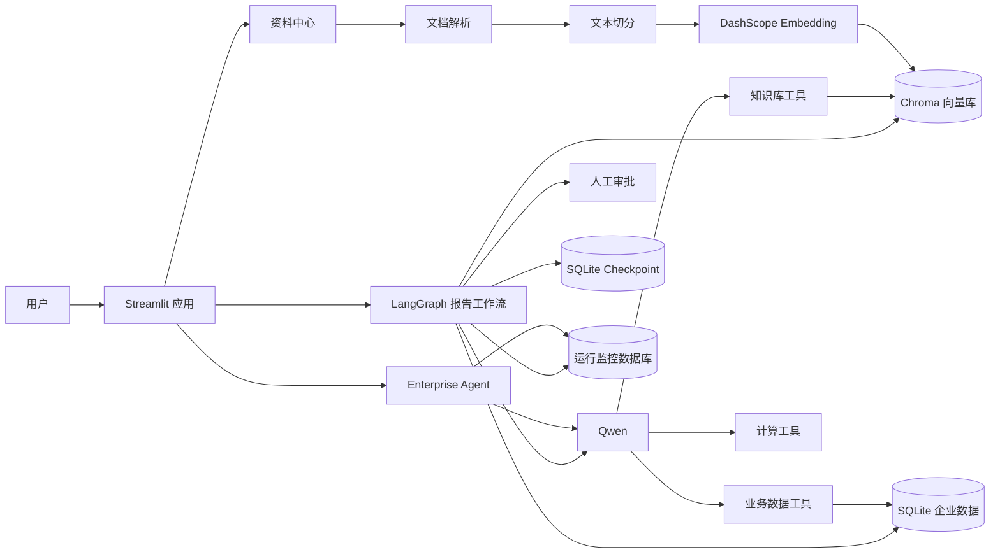
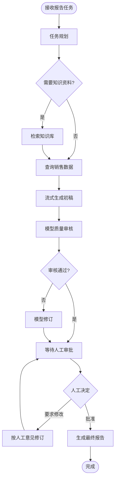

# Enterprise AI Agent 企业智能知识助手


基于 Python、Streamlit、LangChain、LangGraph、Chroma 与通义千问构建的企业智能知识助手 Demo。

项目从基础 RAG 问答系统逐步升级而来，保留文档解析、向量检索和来源引用能力，并增加原生 Function Calling、企业业务工具、多步骤报告工作流、人工审批、任务持久化恢复与运行监控。

> 当前稳定版本：`v1.0.1`（2026-07-15）。该版本属于冻结基线的网络稳定性修复，后续 `v1.0.x` 只进行 Bug、安全、兼容性、测试和文档修复。详细记录见 [CHANGELOG.md](CHANGELOG.md)。

## 界面预览

### 首页



### 知识库资料中心



### 企业报告工作流与人工审批



## 项目亮点

- 支持 TXT、Markdown、PDF、DOCX 文档解析与本地知识库管理
- 使用 DashScope Embedding 与 Chroma 完成文本向量化和语义检索
- 基于检索证据生成回答，并展示来源文件、文本片段与相似度
- Qwen 根据任务自主调用知识库、业务数据库和计算工具
- LangGraph 编排报告规划、资料检索、业务取数、写作、审核与人工审批
- 使用 SQLite checkpoint 保存工作流，服务重启后可以恢复待审批任务
- 流式显示 Agent 回答、报告内容和工作流执行进度
- 记录任务状态、工具调用、节点事件、耗时、Token 用量与异常信息
- 提供 24 项自动化测试，覆盖 Agent 工具、网络重试、文档入库、工作流和可观测性

## 业务场景

### 企业知识查询

员工可以查询公司制度、产品资料和技术文档。系统优先检索上传资料，资料不足时明确说明信息缺失，不使用常识补充企业内部事实。

示例：

```text
根据公司差旅制度，住宿报销需要提交哪些材料？
```

### 企业工具调用

Agent 可以根据问题自主选择工具，查询销售数据、项目状态或执行精确计算。

示例：

```text
统计 2026 年上半年各区域销售额，并计算最高区域与最低区域的差距。
```

### 企业报告工作流

系统可以结合知识库资料和结构化业务数据生成经营分析报告，经过模型审核后暂停，等待人工批准或提交修改意见。

示例：

```text
结合知识库资料与 2026 年上半年各区域销售数据，生成经营分析报告，
说明关键发现、风险和改进建议。
```

## 系统架构



## LangGraph 工作流



工作流在人工审批节点暂停。状态写入 SQLite checkpoint，因此关闭并重新启动应用后，仍可恢复待审批任务。

## Agent 工具

| 工具 | 作用 |
| --- | --- |
| `list_documents` | 查看知识库中的文档 |
| `search_knowledge_base` | 检索企业知识并返回编号引用 |
| `summarize_document` | 总结指定文档 |
| `compare_documents` | 对比两份文档 |
| `query_sales_data` | 按年份、月份和区域查询销售明细 |
| `query_sales_summary` | 汇总各区域销售额 |
| `query_project_status` | 查询企业项目进度 |
| `calculate` | 执行受控的精确计算 |

## 页面功能

| 页面 | 功能 |
| --- | --- |
| 首页 | 展示系统定位与主要能力 |
| 资料中心 | 上传、解析、入库、统计和删除文档 |
| 知识问答 | Agent 自动选工具、RAG 问答、文档总结与文档对比 |
| 企业工作流 | 生成、修改、审批和恢复经营分析报告 |
| 运行监控 | 查看任务状态、耗时、Token、工具和节点事件 |

## 技术栈

- Python 3.12
- Streamlit
- LangChain 0.1.x
- LangGraph 0.0.51
- DashScope / Qwen
- DashScope `text-embedding-v4`
- Chroma
- SQLite
- PyPDF、python-docx

## 项目结构

```text
Enterprise-AI-Agent/
├── app.py                     # Streamlit 统一入口与导航
├── app_upload.py              # 资料中心页面
├── app_chat.py                # RAG 与 Agent 问答页面
├── app_workflow.py            # 企业报告工作流页面
├── app_observability.py       # 运行监控页面
│
├── enterprise_agent.py        # Qwen Function Calling Agent
├── report_workflow.py         # LangGraph 状态图与 checkpoint
├── knowledge_base.py          # 文档切分、去重和向量入库
├── document_parser.py         # TXT、MD、PDF、DOCX 解析
├── rag.py                     # 检索、引用回答、总结与对比
├── vector_stores.py           # Chroma 检索封装
├── database_service.py        # SQLite 企业演示数据
├── observability.py           # 运行记录与事件指标
├── file_history_store.py      # 文件型会话历史
├── config_data.py             # 模型、路径和检索配置
│
├── tools/                     # 知识、业务和计算工具
├── tests/                     # 自动化测试
├── assets/                    # 可公开的演示资料
├── data/                      # 本地运行数据，已被 Git 忽略
├── legacy/                    # 不参与当前运行的早期实现
│
├── requirements.txt
├── .env.example
├── .gitignore
├── start.bat
└── README.md
```

## 快速开始

### 1. 进入项目目录

```powershell
cd <你的项目路径>
```

### 2. 创建并启用虚拟环境

```powershell
python -m venv .venv
.\.venv\Scripts\Activate.ps1
```

如果已经创建 `.venv`，只需要执行启用命令。

### 3. 安装依赖

```powershell
python -m pip install -r requirements.txt
```

### 4. 配置环境变量

复制 `.env.example` 为 `.env`：

```powershell
Copy-Item .env.example .env
```

在 `.env` 中填写 DashScope API Key：

```dotenv
DASHSCOPE_API_KEY=your_dashscope_api_key_here
```

不要把真实 `.env` 或 API Key 提交到 Git。

### 5. 启动应用

```powershell
.\.venv\Scripts\python.exe -m streamlit run app.py
```

也可以运行：

```powershell
.\start.bat
```

浏览器默认访问：

```text
http://localhost:8501
```

## 自动化测试

执行全部测试：

```powershell
.\.venv\Scripts\python.exe -B -m unittest discover -s tests -v
```

当前测试覆盖：

- 知识库、业务数据库和计算工具
- Agent 流式事件与知识引用提取
- 空文件校验与向量入库失败回滚
- LangGraph 分支、修订、人工审批与持久化恢复
- 运行事件、Token 和状态记录

## 推荐演示流程

### 场景一：知识库问答

1. 在“资料中心”上传企业制度或产品文档。
2. 进入“知识问答”，选择“Agent 自动选择”。
3. 提问文档中的明确事实。
4. 展示 Agent 工具调用、引用编号和检索依据。

### 场景二：多工具业务查询

1. 询问 2026 年上半年各区域销售情况。
2. 要求计算最高区域与最低区域的差额或增长比例。
3. 展示数据库工具与计算工具的连续调用。

### 场景三：报告工作流

1. 进入“企业工作流”并生成经营分析报告。
2. 展示规划、检索、取数、写作和审核节点。
3. 输入人工修改意见并重新生成。
4. 批准最终报告。
5. 进入“运行监控”查看任务状态、耗时和 Token。

### 场景四：持久化恢复

1. 让报告运行到等待人工审批。
2. 关闭 Streamlit。
3. 重新启动并恢复待审批任务。
4. 完成批准或修改流程。

## 本地数据与安全

以下内容保存在 `data/`，并已通过 `.gitignore` 排除：

- 上传文档生成的 Chroma 向量数据
- 文档登记信息和内容哈希
- 本地会话历史
- 企业演示数据库
- LangGraph checkpoint
- Agent 与工作流运行记录

注意事项：

- 上传真实企业资料前应先脱敏。
- 不要提交 `.env`、本地数据库、向量数据和用户文档。
- 当前企业数据库为虚构的演示数据，不连接真实生产系统。
- 计算和业务查询工具采用限定参数，不允许模型执行任意 SQL 或系统命令。

## 常见问题 

### 提示未配置 DASHSCOPE_API_KEY

确认项目根目录存在 `.env`，并且包含：

```dotenv
DASHSCOPE_API_KEY=正确的密钥
```

修改后重新启动 Streamlit。

### PDF 无法提取文字

当前 PDF 解析针对包含文本层的文件。扫描版 PDF 需要先通过 OCR 转换为可检索文本。

### 文档提示内容已存在，但列表中没有文档

系统会检查内容哈希与 Chroma 实际向量。如果发现旧哈希没有对应向量，会自动清理孤立记录并重新入库。

### 工作流执行失败或无法恢复

进入“运行监控”查看异常类型。确认 `data/` 目录可写，并避免同时运行多个修改同一 checkpoint 的应用实例。

### Chroma 或 SQLite 文件被占用

先停止正在运行的 Streamlit/Python 进程，再移动或清理 `data/` 中的运行文件。

## 项目边界

当前项目定位为企业 Agent 求职作品 Demo，而不是生产系统。生产化还需要补充：

- 用户登录、租户隔离与权限控制
- 企业数据库连接池与字段级权限
- 提示词注入防护与敏感数据审计
- RAG 检索和生成质量评测
- 并发任务、限流、重试和告警
- Docker、CI/CD 与部署配置

## 简历描述参考

> 基于 LangChain、LangGraph、通义千问与 Chroma 构建企业智能知识助手，实现多格式知识入库、RAG 检索增强问答、Function Calling、企业数据查询及报告自动化工作流；支持模型质量审核、人工审批、任务持久化恢复与执行可观测性。

## License

本项目使用仓库中的 `LICENSE` 文件所声明的开源许可证。
